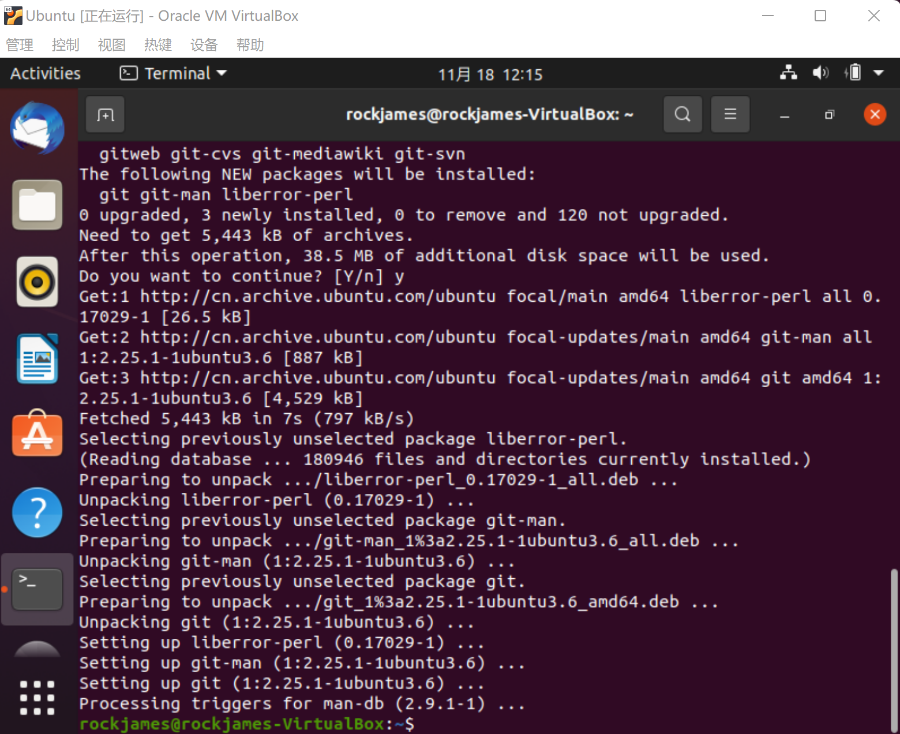

# CUC_CSAPP
CUC深入理解计算机系统实验资料

## Ubuntu环境搭建教学（保姆级）

- 虚拟机Virtual Box6.1（VMare原理一致）
- 镜像：ubuntu-20.04.5-desktop-amd64.iso

## 安装流程

### 0 下载Ubuntu镜像源

镜像源下载地址：https://cn.ubuntu.com/download/desktop（官方地址）

由于官方地址在国外，如果无法科学上网，可以使用清华大学的镜像源：https://mirrors.tuna.tsinghua.edu.cn/ubuntu-releases/20.04/

### 1 创建虚拟机

在“工具”条目选择“新建”，在弹出的对话框里输入“虚拟机名称”，以及虚拟机安装的“文件夹”，然后“类型”选择 Linux，“版本”选择 Ubuntu (64-bit)，点击下一步。


将虚拟机的内存大小设置为 2048MB，点击下一步。


选择“现在创建虚拟硬盘”，点击“创建”。


选择“VDI”类型，点击“下一步”。


选择“动态分配”，点击“下一步”。


这里将虚拟硬盘的大小调节为20-30GB左右，然后点击“创建”即可。


建议在”设置-常规-高级“开启双向粘贴板、拖放，方便后续实验操作


### 2 安装Ubuntu

对新创建的虚拟机进行设置修改，在“设置 - 网络”里选择网卡位”桥接网卡“


在”存储-控制器“中选择已经下载好的Ubuntu镜像


建议语言选择”English“，方便后续问题查找和复现，直接点”install Ubuntu“


然后继续点击“Continue”，


继续”Continue“


点击 “Install Now”，之后全部”continue“


选择时区为 “Shanghai”，点击 “Continue”


输入用户名和密码，点击 “Continue”，开始安装


耐心等待安装


## CSAPP实验环境下载配置（以实验#1 Datalab为例）

推荐安装增强功能


打开虚拟机启动后，输入`Ctrl+Alt+T`打开控制台


**在根目录里安装Vim工具**

```shell
sudo apt install vim
```

**Vim**是从[vi](https://zh.m.wikipedia.org/wiki/Vi)发展出来的一个文本编辑器。其代码补完、编译及错误跳转等方便编程的功能特别丰富，在程序员中被广泛使用。和[Emacs](https://zh.m.wikipedia.org/wiki/Emacs)并列成为[类Unix系统](https://zh.m.wikipedia.org/wiki/类Unix系统)用户最喜欢的编辑器。


**安装Git**

```shell
sudo apt-get install git
```

**git**是用于Linux内核开发的版本控制工具。与CVS、[Subversion](https://zh.m.wikipedia.org/wiki/Subversion)一类的集中式版本控制工具不同，它采用了分布式版本库的作法，不需要服务器端软件，就可以运作版本控制，使得源代码的发布和交流极其方便。git的速度很快，这对于诸如Linux内核这样的大项目来说自然很重要。git最为出色的是它的合并追踪（merge tracing）能力。

下载



**下载实验资料**

提供两种方式：

#### 方法1：

- 直接从CSAPP官网下载对应的实验附件压缩包:此处以第一次实验（Datalab）为例：

  

  在命令行中直接下载：

  ```C
  wget http://csapp.cs.cmu.edu/3e/datalab-handout.tar
  ```

  下载好后输入`ls`查看当前目录下是否有下载好的实验压缩包

  

将从官网下载的tar包解压，指令：`tar xvf FileName.tar`

```shell
tar xvf datalab-handout.tar
```

查看当前目录可以看到解压后的文件夹：


#### 方法2：

直接通过前面下载的git工具直接从我已经提供的[实验仓库](https://github.com/Xuyan-cmd/CUC_CSAPP)进行下载：

```shell
git clone https://github.com/Xuyan-cmd/CUC_CSAPP.git
```

再进入下载好的文件夹`CUC_CSAPP`即可看到实验代码：


如果你访问Github出现困难，我同时提供了国内的代码仓库[Gitee](https://gitee.com/rockjames/CUC_CSAPP)的地址，使得访问不受网络限制：

语句相同如下：

```shell
git clone https://gitee.com/rockjames/CUC_CSAPP.git
```


**进入`datalab-handout`文件夹**

安装`make`

```shell
sudo apt install make
```

安装`gcc`

```shell
sudo apt install gcc
```

此时在命令行中输入make会报错，这是因为lab运行在32位，但下载的Ubuntu是64位的，可以通过输入指令解决该问题

```shell
sudo apt-get install gcc-multilib
```


`gcc-multilib` 主要是为了支持编译32位程序安装的，也就是后续 gcc 编译命令的 `-m32` 选项

由于当前gcc版本更新后和gcc-multilib版本不兼容，因此需要进行降级 gcc，解决依赖关系：

- 更新软件源

  ```shell
  $ sudo apt-get update
  ```

- 安装 `aptitude` 程序，这个是包管理器程序，解决依赖关系很方便，否则手动解决会很麻烦。

  ```shell
  $ sudo apt-get install aptitude
  ```

- 使用 aptitude 安装 `gcc-multilib`

  ```shell
  $ sudo aptitude install gcc-multilib
  ```

  这个命令首先会检查依赖关系， 第一次提示是否接受当前方案(这个方案什么都不做)，选择 n。 第二次提示给出降级的方案，选择 Y。

#### 测试平台搭建是否完成

在`/#1_Datalab`目录下使用vim打开`bits.c`文件，键入`i`，进入编辑模式，向下滚动，可以找到需要实现的函数。完成第一个函数实验，`int bitXor(int x, in y){}`


保存完毕后，在终端中依次输入`make clean`、`make`、`./btest`指令。
`make clean`：清除上次的make命令所产生的object文件，
`make`：编译本次文件
`./btest`：测试代码


能够看到，修改后的`bits.c`文件能够成功通过检测，因此平台搭建已全部完成，可以进行后续实验。

## 你可能遇到的问题

- 在导入Ubuntu时候会出现黑屏卡住的现象，无法继续进行安装，可以通过修改Virtualbox中Ubuntu虚拟机的显存大小和分配处理器个数来解决：

  - **显存大小可分配40MB左右**
  - 

  - 处理器选择尽量多分配一些，例如4个即可
  - 

- 在进行Ubuntu安装过程中，可能由于电脑显示屏分辨率较小，无法显示安装按钮，可以按住键盘中的win键拖动鼠标在安装界面底端向上滑动即可解决。
